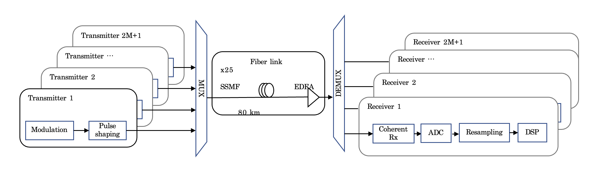
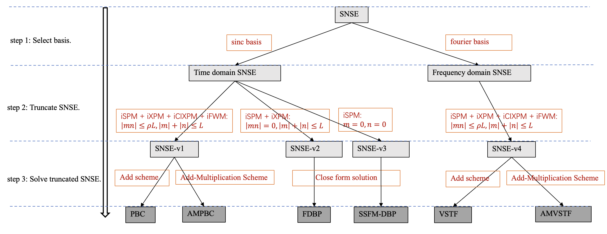
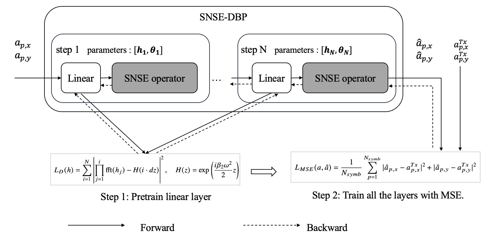
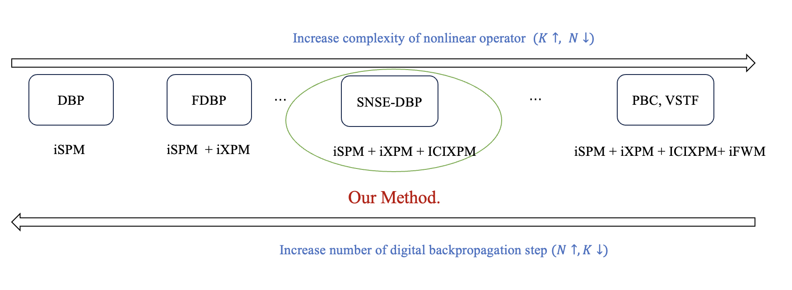
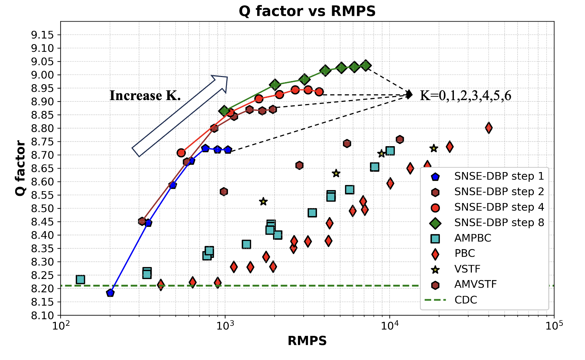
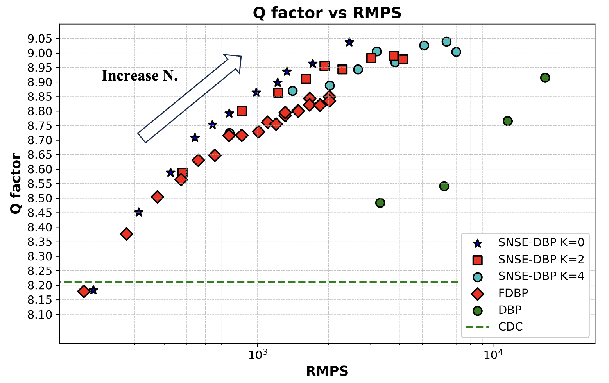

# Learning effective nonlinear operator for high speed optical compensation system.
This project is to develop the effective nonlinear compensation algorithms for high speed optical compensation system. related to the paper: [Learning effective nonlinear operator for high speed optical compensation system, Optics Express, 2025].

## Installation

1. Create and activate a conda environment:
```bash
conda create -n snse python=3.9 
conda activate snse
```

2. Install the package:
```bash
pip install -e .
```

## Dataset Preparation

You have two options to prepare the dataset:

1. Download the pre-generated dataset:
Download from [here](https://drive.google.com/) and place it in the `data` folder. (the link is not available yet, we will fix it soon)

1. Generate the simulation dataset:
```bash
python -m scripts.data --config configs/data/80G_3ch.yaml --path data/train.h5
python -m scripts.data --config configs/data/80G_3ch.yaml --path data/test.h5
```



## Model Training and Testing

In our paper, we have trained two families of models:

1. **PPC Models** (PBC, AMPBC, VSTF, AMVSTF)
2. **DBP Models** (FDBP, SNSE-DBP)



### 1. PPC Models (PBC, AMPBC, VSTF, AMVSTF)

#### Training
```bash
./scripts/train_eq.sh your_experiment_name configs/ppc/pbc.yaml
```

Available model configurations:
- Perturbation Based Compensation (PBC): `configs/ppc/pbc.yaml`
- Add-Multiplication Perturbation Based Compensation (AMPBC): `configs/ppc/ampbc.yaml`
- Volterra Series Transfer Function (VSTF): `configs/ppc/vstf.yaml`
- Add-Multiplication Volterra Series Transfer Function (AMVSTF): `configs/ppc/amvstf.yaml`

#### Testing
```bash
python -m scripts.test_eq --path experiments/your_experiment_name --test_config configs/test_eq.yaml
```

### 2. FDBP Models

#### Post-Processing DBP (samples per symbol = 1)

Training:
```bash
./scripts/train_eq.sh your_fdbp_experiment_name configs/dbp/fdbp_sps1.yaml
```

Testing:
```bash
python -m scripts.test_eq --path experiments/your_fdbp_experiment_name --test_config configs/dsp/test_eq.yaml
```

#### Classical DBP (samples per symbol = 2)
Training:
```bash
./scripts/train_ldbp.sh fdbp_sps2_experiment_name configs/dbp/fdbp_sps2.yaml
```

Testing:
```bash
python -m scripts.test_ldbp --path experiments/fdbp_sps2_experiment_name --test_config configs/dsp/test_ldbp.yaml
```

### 3. SNSE-DBP Models (Our proposed model)




**Training**:
```bash
./scripts/train_eq.sh snse_dbp_experiment_name configs/dbp/snsedbp.yaml
```
```
# configs/dbp/snsedbp.yaml:

model_info:
  Nmodes: 2
  step: 5                   # (step = N, the number of back propagation steps in paper)
  dtaps: 801
  ntaps: 401
  d_share: false
  n_share: false
  Fs: 80.e+9
  test_version: true
  no_icixpm: false
  n_fwm: 0                  # (n_fwm = K, number of iFWM kernels in paper)
```


**Testing**:
```bash
python -m scripts.test_eq --path experiments/snse_dbp_experiment_name --test_config configs/test_eq.yaml
```

## Reproducing Paper Results

To reproduce all results from the paper:
```bash
./main.sh
```

Results will be saved in the `experiments` folder.

## Visualization

The following Jupyter notebooks are provided for result visualization:
- `show_kernel.ipynb`: Visualize kernel analysis
- `show_qfactor_power.ipynb`: Q-factor vs power analysis
- `show_qfactor_rmps.ipynb`: Q-factor vs RMPS analysis
- `show_two_stage_train.ipynb`: Two-stage training visualization





## Dependencies

The project requires the following main dependencies:
- Python >= 3.7
- PyTorch
- NumPy
- SciPy
- Matplotlib
- Pandas
- H5py
- PyYAML
- scikit-commpy
- TensorBoard
- Jupyter
- NeuralOperator
- Seaborn
- JAX
- Flax

If you want to train the model by yourself, you would better work on a GPU with at least 16GB memory.
## License

This project is licensed under the MIT License - see the [LICENSE](LICENSE) file for details.

## Cite This Project
```
@misc{Xiao2025pkufiber,
  author       = {Xinyu Xiao},
  title        = {{pkufiber: Code and data for "Learning effective nonlinear operator for high speed optical compensation system"}},
  year         = {2025},
  howpublished = {\url{https://github.com/xinyuxiao113/pkufiber }},
  note         = {Accessed: 2025-05-22}
}
```

<!-- ## Citation

If you use this code in your research, please cite our paper:

```bibtex
@article{snse2025,
  title={Learning effective nonlinear operator for high speed optical compensation system},
  author={[Author Names]},
  journal={Optics Express},
  year={2025},
  volume={},
  number={},
  pages={},
  publisher={Optical Society of America}
}
```

For any questions or issues, please open an issue in this repository.
 --> 


